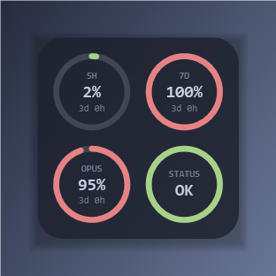

# Claude Usage Widget

[](https://github.com/TadelUnso/claude-usage-widget/actions/workflows/ci.yml)
[](https://github.com/TadelUnso/claude-usage-widget/releases)
[](LICENSE)
[](https://ko-fi.com/tadel_unso)

A macOS desktop widget showing Claude Code subscription limits and Claude's
own service status, as four dials in a square panel that sits at desktop
level — above the wallpaper, below every application window.



## The panel

A 2x2 grid:

- **SESSION** — the 5-hour session limit
- **WEEK** — the 7-day weekly limit
- One per-model weekly limit — Fable's by default when the account has one,
  otherwise whichever the server returns; pick a specific one from the menu
  bar when more than one applies
- **STATUS** — Claude's own service status; click it to open
  [status.claude.com](https://status.claude.com)

Each usage dial fills its arc with the share of the limit already spent:
green below 60%, amber below 85%, red above. The centre reads the percentage
and the time left until the window resets. The status dial fills its ring
solid rather than to a fraction — there is no percentage for "operational" or
"down", only a state.

Hovering the panel reveals a header strip: an eye icon to hide the widget
(bring it back from the menu bar), a Ko-fi button, and a lock icon that pins
the panel against dragging and resizing. Drag any edge to resize — the panel
always stays square, one side length driving both dimensions, clamped between
150 and 340 pt. Drag anywhere in the middle to move it; position and size are
both remembered across launches.

## Menu bar

The three usage dials' live percentages are drawn into the menu bar as two-row
columns (a short label over the figure), so the numbers are visible without
opening the panel.

The menu itself:

- **Claude Usage Widget vX.Y.Z — GitHub** — opens the repository
- **Report an Issue**
- **Check for Updates…** — asks Sparkle to check the appcast right now
- **Refresh now** — fetch immediately instead of waiting out the 5-minute cycle
- **Model limit** — pick which per-model weekly limit the third dial shows
  (appears once the server returns more than one)
- **Lock position**
- **Show on desktop** — hide the panel while keeping the menu bar item
- **Launch at login**
- **Quit Claude Usage Widget**

## How it reads your usage

The widget calls `https://api.anthropic.com/api/oauth/usage` with the OAuth
token Claude Code already stores in your login keychain. It reads that item
and nothing else, and never writes to it — Claude Code owns and refreshes
those credentials. macOS asks for permission the first time the widget reads
the keychain item, and again after every rebuild from source: an ad-hoc code
signature changes with each build, and macOS treats a differently-signed
binary as a new requester. If the token has expired, the widget says so and
the next Claude Code session refreshes it.

## Update

Once installed from a signed DMG, the app keeps itself up to date through
[Sparkle](https://sparkle-project.org): it checks the appcast in the
background at launch and offers to install newer releases in place.
"Check for Updates…" in the menu bar drives the same mechanism manually.

A `make app` bundle built locally is ad-hoc signed (`codesign --sign -`), so
macOS treats each rebuild as a new, unverified binary — the keychain
permission granted for one build does not carry over to the next. That is a
development artifact; released users only ever run the signed, notarised DMG
from GitHub Releases.

## Service status

The fourth dial reads `https://status.claude.com`, preferring the "Claude
Code" component's status; if that component is ever renamed or retired, it
falls back to the page-wide status instead.

## Known limitations

**A Claude subscription is required.** The usage endpoint this widget reads is
subscription-only. If Claude Code is authenticated with an API key, Bedrock or
Vertex, usage is billed per token and no session or weekly limit exists — the
widget will say so rather than show empty dials, and there is nothing to
configure.

**The per-model dial depends on your plan.** A separate weekly limit for a
specific model is a Max and Team Premium arrangement. On Pro and Team Standard
that model is billed from usage credits instead, so the third dial shows
whichever per-model limit your account does have, or `n/a` if it has none.

**Apple silicon only.** Releases are built for arm64. Intel Macs can build from
source but there is no signed build for them.

**macOS asks for keychain access on first launch.** The widget reads the token
Claude Code stored there; approving once is enough. A locally built bundle is
ad-hoc signed, so each rebuild counts as a new app and asks again — that affects
development, not installed releases.

## Requirements

- macOS 14+, Apple silicon
- Claude Code, signed in
- Swift 6 toolchain, to build from source — Command Line Tools are enough
  (`xcode-select --install`)

## Install

### Homebrew

```bash
brew install --cask TadelUnso/tap/claude-usage-widget
```

The cask installs the signed, notarised DMG from Releases. It declares
`auto_updates true`, so Homebrew steps aside and lets the widget update itself
through Sparkle — there is no separate `brew upgrade` step.

### Direct download

Download `ClaudeUsageWidget.dmg` from the
[Releases page](https://github.com/TadelUnso/claude-usage-widget/releases), open
it, and drag the widget into Applications. The app is signed and notarised, and
its notarisation ticket is stapled to the bundle, so Gatekeeper accepts it even
on a machine with no network.

## Uninstall

```bash
brew uninstall --cask claude-usage-widget
```

Add `--zap` to remove the saved position, size and preferences as well.

Uninstalled while it was still running? The orphaned process keeps the widget on
screen — quit it from the menu bar, or:

```bash
pkill -f "Claude Usage Widget"
```

## Build

```bash
make app
open "dist/Claude Usage Widget.app"
```

## Development

```bash
make run    # run a dev build
make test   # run the test suite (98 tests)
```

> **Important:** run tests only via `make test`. On a machine without full Xcode
> a bare `swift test` silently runs zero tests and exits 0 — the Makefile passes
> the toolchain flags Swift Testing needs from Command Line Tools.

> **Before tagging a release:** bump both `CFBundleShortVersionString` (to the
> tag's version) and `CFBundleVersion` (to any higher integer) in
> `Resources/Info.plist`. Sparkle compares `CFBundleVersion`, not the marketing
> string, to decide whether an update exists — the release workflow refuses to
> publish if either is not bumped.

## Architecture

```
Sources/ClaudeUsageWidgetCore/
  Auth/          — keychain read
  Usage/         — decoding, pure math, thresholds, bucket selection, the HTTP call
  Status/        — Claude's own service status: fetch and decode
  Store/         — @Observable stores, 5-minute refresh
  Formatting/    — menu bar text
  Update/        — GitHub repository and issue links (update detection is Sparkle's)
  Views/         — SwiftUI dials, status ring and panel
Sources/ClaudeUsageWidget/  — app shell: desktop window, MenuBarExtra
```

All computation is pure functions over a decoded snapshot and is unit-tested;
the keychain reader and the HTTP clients are thin wrappers with smoke tests.
