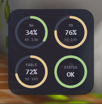

# Claude Usage Widget (Windows)

[](https://github.com/Reva1v/claude-usage-widget/actions/workflows/ci.yml)
[](https://github.com/Reva1v/claude-usage-widget/releases/latest)
[](LICENSE)

A Windows desktop widget showing Claude Code subscription limits and Claude's
own service status, as four dials in a square panel pinned to the bottom of
the desktop.

This is a Windows port (C#/.NET 8 + WPF) of
[TadelUnso/claude-usage-widget](https://github.com/TadelUnso/claude-usage-widget),
the original macOS app. It reads the same figures through the same
authenticated claude.ai web session; the desktop widget, tray icon, sign-in
flow, refresh cycle and settings persistence are all reimplemented for
Windows.

<p align="center">
  
</p>

The optional taskbar band — transparent, just the figures, docked to the
taskbar's left corner or next to the tray icons:

<p align="center">
  
</p>

<p align="center">
  
</p>


## The panel

One row per account, up to four. Each row is the account's name and three
dials; each dial reads its percentage with the time until that window resets
underneath.

With a single account — the usual case — that is one row, and the panel behaves
as it always has. Rows follow the order accounts were added, never their usage:
this is a full picture, not a ranking. An account whose refresh failed keeps its
row with `n/a` dials rather than vanishing and shifting the rows below it.

The three dials per row:

- **5H** — the 5-hour session limit
- **7D** — the 7-day weekly limit
- One per-model weekly limit — whichever the server returns; pick a specific
  one from the tray menu when more than one applies

Each usage dial fills its arc with the share of the limit already spent:
green below 60%, amber below 85%, red above. The centre reads the percentage
and the time left until that window resets.

Claude's own service status is shared by every account, so it reads as text in
the status line under the dials rather than taking a dial in every row. It
stays quiet while the service is operational.

The panel is bottom-pinned on the desktop, sits behind application windows,
and can be dragged, resized and locked in place; position, size and lock
state are all remembered across launches. An optional taskbar band can show
every account's 5-hour figure and reset time docked to the taskbar (see Known
limitations below).

## Tray icon

The tray icon shows a live figure and opens a menu with:

- **Claude Usage Widget vX.Y.Z — GitHub** — opens the repository
- **Report an Issue**
- **Refresh now** — fetch immediately instead of waiting out the 5-minute
  cycle
- **Sign in to Claude.ai…** — the sign-in window has a paste box above the
  page. Magic-link sign-in only works if the link is opened in *this* window:
  clicking it in your mail client signs your normal browser in instead, and the
  link is usually single-use
- **Accounts** — the account list, with the one the tray icon describes ticked.
  Each account has **Rename…** and **Sign out and remove**; **Add account…**
  opens a sign-in window for a new one and is disabled once four are configured
- **Tray shows** — pick which figure (5H, 7D or MODEL) the tray icon itself
  displays
- **Model limit** — pick which per-model weekly limit the dial shows
  (appears once the server returns more than one)
- **Layout → Edit layout…** — edit the panel in place. Cells swap by dragging
  one onto another, and a strip of buttons appears just outside the panel:
  **Done**, the two flow directions (accounts, and the dials inside an
  account), where the account name sits, the subscription-plan line, the
  status line or dial, the per-model dial, lock and hide
- **Show on desktop** — hide the panel while keeping the tray icon
- **Taskbar band** — toggle the optional taskbar-docked figure display
- **Band position** — dock the band near the tray icons or in the taskbar's
  left corner
- **Lock position**
- **Launch at login**
- **Quit Claude Usage Widget**

## How it reads your usage

The widget reads your usage through an authenticated claude.ai session. On
first launch it opens a sign-in window (a WebView2 view of claude.ai); once
you are signed in, the session cookie lives in the widget's own cookie store
under `%LOCALAPPDATA%\ClaudeUsageWidget\profiles\default`, and the widget asks
`claude.ai/api/organizations/<id>/usage` for the same figures the web app shows
you. The sign-in window's cookie store is isolated from your regular browsers —
signing in here does not touch Chrome, Edge or any other browser, and signing
out of one does not sign out the other. Sign in again from the tray menu
whenever the session expires.

Each account is a separate WebView2 *profile* inside that one store, so their
cookies, organizations and rate-limit backoff are independent: one account
sitting out a 429 does not stop the others refreshing. The accounts are polled
on the same five-minute cycle but spread across it rather than all at once.

Upgrading from a single-account build keeps you signed in: the existing account
is carried over as-is, along with its organization and retry state.

It deliberately does not use `api.anthropic.com/api/oauth/usage`. That
endpoint carries a Cloudflare rate limit strict enough that a widget polling
every five minutes trips it, and the resulting block is renewed by each
further request rather than expiring — the widget could then never recover
on its own. Requests back off on HTTP 429 responses instead.

## Handing the figures to another tool

Off by default. Set `ExportDirectory` in
`%APPDATA%\ClaudeUsageWidget\settings.json` and every account writes its latest
figures to `<ExportDirectory>\<account name>.widget.json` after each successful
refresh — the name lowercased, with anything outside `a-z 0-9 _ -` turned into
`-`. A single account's `ExportPath` still overrides the directory for that
account. Keys in this file are camelCase, as shown.

```json
{ "fiveHour": 62, "sevenDay": 30, "atMs": 1787748230070,
  "fiveResetAt": 1787750400, "sevenResetAt": 1787860800,
  "account": "Personal", "modelKey": "seven_day_fable", "modelLabel": "FABLE",
  "modelSevenDay": 15, "modelResetAt": 1788278400 }
```

`atMs` is epoch milliseconds; the three reset stamps are epoch seconds. The
`model*` four describe the per-model weekly limit the third dial shows and are
all null on an account that has none. The file is written whole (temp file,
then move), so a reader polling it never catches half of one. Nothing is
written for an account with neither window — zeros would read as "0% used",
which is the opposite of the truth.

## Service status

The status line reads `https://status.claude.com`, preferring the "Claude
Code" component's status; if that component is ever renamed or retired, it
falls back to the page-wide status instead.

## Diagnostics

The widget keeps a log at `%LOCALAPPDATA%\ClaudeUsageWidget\widget.log`, always
on, one line per event: failed and retried navigations, WebView2 process
failures, sign-in windows opening and closing, and every browser launch. Nothing
is written on a healthy five-minute refresh, so the file stays small; it rotates
at 1 MB, keeping one previous copy as `widget.log.1`.

## Known limitations

**A Claude subscription is required.** The usage endpoint this widget reads
is subscription-only. On an account billed per token there is no session or
weekly limit to show — the widget will say so rather than show empty dials,
and there is nothing to configure.

**The usage API is undocumented.** It is the same call claude.ai makes for
its own usage screen, so it can change without notice and take the dials
with it.

**Four accounts is the cap.** Above that the rows stop being readable at the
default panel size and the per-cycle request count stops being polite to an
undocumented endpoint. It is one constant (`AccountLimits.Max`) if you disagree.

**The screenshots above show the single-account panel.** They predate the
per-account rows.

**The per-model dial depends on your plan.** A separate weekly limit for a
specific model is a Max and Team Premium arrangement. On Pro and Team
Standard that model is billed from usage credits instead, so the dial shows
whichever per-model limit your account does have, or `n/a` if it has none.

**Taskbar band is a transparent window docked above the taskbar, not a true
embed.** Windows 11's Mica compositing over the taskbar makes genuinely
embedded (`WS_CHILD` of `Shell_TrayWnd`) content illegible — confirmed by
direct pixel measurement — so the band is instead a normal top-level window
*owned* by the taskbar (it always stays above it, without the Mica dimming a
`WS_CHILD` gets). It doesn't steal focus or show up in Alt-Tab, and renders
white text with a subtle shadow directly over your wallpaper/taskbar color.

The band decides its visibility from ground truth rather than heuristics: it
probes which window actually sits over the taskbar area and hides only when
the taskbar itself is genuinely covered (a real fullscreen app, e.g. a game)
— whenever the taskbar is visible, so is the band. It also detects when the
shell re-raises the taskbar over a maximized app without bringing owned
windows along (which would silently bury the band) and re-asserts itself.
Pick where it docks — next to the tray icons (default) or the taskbar's
left corner — from the tray menu's "Band position" submenu. For
troubleshooting, set the environment variable `CLAUDE_BAND_DIAG=1` and the
band logs its visibility decisions to `%TEMP%\claude-band-diag.log`.

**Signing in happens in the widget's own window.** The sign-in window is a
WebView2 view of claude.ai with its own cookie store, isolated from your
regular browsers.

## Requirements

- Windows 11 (WebView2 Runtime is preinstalled). On Windows 10, install the
  [WebView2 Evergreen Runtime](https://developer.microsoft.com/microsoft-edge/webview2/)
  first.
- A Claude.ai account on a subscription plan
- .NET 8 SDK, to build from source

## Run

```
dotnet run --project src/ClaudeUsageWidget.App
```

## Publish

```
dotnet publish src/ClaudeUsageWidget.App -c Release -r win-x64 --self-contained -p:PublishSingleFile=true
```

## Development

```
dotnet test
```

Set `CUW_RENDER_PREVIEW` to a directory and the app renders every layout
combination to PNG there and exits instead of starting. The panel sits behind
application windows on purpose, so a desktop screenshot shows whatever is
covering it — this does not depend on the state of anyone's desktop.

```powershell
$env:CUW_RENDER_PREVIEW = "$env:TEMP\cuw-layouts"; dotnet run --project src/ClaudeUsageWidget.App
```

309 tests across `Tests/ClaudeUsageWidget.Core.Tests`.

## Architecture

```
src/ClaudeUsageWidget.Core/   — decoding, pure math, thresholds, bucket
                                 selection, settings, the HTTP calls
  Usage/    — usage snapshot decoding and math
  Status/   — Claude's own service status: fetch and decode
  Store/    — observable stores, rate-limit backoff
  Settings/ — settings.json persistence
  Formatting/, Views/, Web/ — shared formatting and view/session helpers
src/ClaudeUsageWidget.App/    — WPF app shell: desktop widget window, tray
                                 icon, taskbar band, sign-in window (WebView2),
                                 launch-at-login, 5-minute refresh timer
Tests/ClaudeUsageWidget.Core.Tests/ — xUnit tests for ClaudeUsageWidget.Core
```

All computation is pure functions over a decoded snapshot and is unit-tested;
the session reader and the HTTP clients are thin wrappers with smoke tests.

## Credits

This project is a Windows port of
[TadelUnso/claude-usage-widget](https://github.com/TadelUnso/claude-usage-widget).
All credit for the original design and concept goes to the upstream project.
Licensed under the [MIT License](LICENSE).
